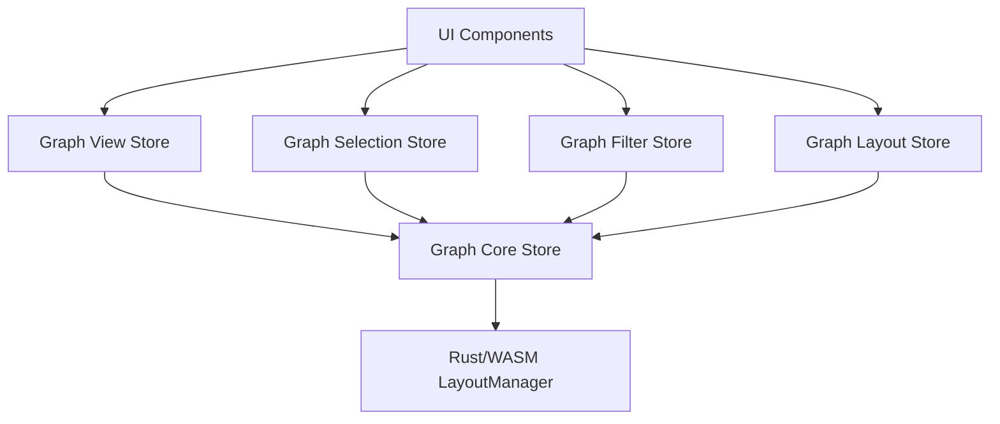

# jump-cannon Application Architecture

## Action System Architecture

The jump-cannon application implements a flexible and extensible action system inspired by VSCode's command palette. This document outlines the architecture, components, and features of this system.

## Graph System Architecture

The graph system implements a modular architecture for managing and visualizing graph data. It uses WebAssembly (WASM) for efficient graph layout calculations and provides a clean separation of concerns through specialized stores.

### Store Architecture



### Core Components

1. **Graph Core Store** (`stores/graph/core.ts`)
   - Central store managing graph data and WASM interaction
   - Handles WASM initialization and lifecycle
   - Maintains core graph data (nodes and edges)
   - Provides fundamental graph operations
   - Coordinates layout operations through WASM
   - Interfaces:
     ```typescript
     interface Node {
       id: string
       label: string
       position?: [number, number]
       metadata: Record<string, any>
       type?: string
       x: number
       y: number
     }

     interface Edge {
       id: string
       source: string
       target: string
       metadata: Record<string, any>
       type?: string
       weight: number
     }
     ```

2. **Graph Layout Store** (`stores/graph/layout.ts`)
   - Manages layout algorithms and configurations
   - Supports multiple layout algorithms (fCoSE, concentric, dagre)
   - Maintains layout history for undo operations
   - Coordinates with core store for layout application
   - Features:
     - Layout algorithm selection
     - Configurable layout parameters
     - Layout history tracking
     - Undo/redo support

3. **Graph Selection Store** (`stores/graph/selection.ts`)
   - Handles node and edge selection state
   - Manages hover states
   - Provides selection utilities
   - Features:
     - Multi-select support
     - Connected node selection
     - Edge selection between nodes
     - Hover state management

### WASM Integration

The system uses a Rust-based WASM module for efficient graph layout calculations:

- Direct integration through the Graph Core Store
- Handles node and edge position calculations
- Supports multiple layout algorithms
- Provides efficient data transfer between Rust and JavaScript

### Features

1. **Efficient Graph Operations**
   - Fast graph traversal and manipulation
   - Optimized layout calculations via WASM
   - Efficient state management with Pinia

2. **Flexible Layout System**
   - Multiple layout algorithm support
   - Configurable layout parameters
   - Layout history tracking
   - Undo/redo capabilities

3. **Advanced Selection Features**
   - Multi-select support
   - Connected node selection
   - Edge selection between nodes
   - Hover state management

4. **Extensible Architecture**
   - Modular store design
   - Clear separation of concerns
   - Easy addition of new features
   - Plugin-based layout system


## Core Concepts

### Actions

Actions are the fundamental building blocks of the system. An action represents a command that can be executed by the user. Actions can be:

- **Singleton**: Can only be applied once per workspace
- **Multi-instance**: Can be applied multiple times with different parameters

Actions are organized hierarchically and can be categorized for easier discovery.

### Action Parameters

Actions can define parameters that need to be configured before execution. Parameters support various types and validation rules.

### Action Instances

When an action is executed, it creates an instance that maintains the action's state. For multi-instance actions, multiple instances can exist simultaneously.

## Component Architecture

```
┌─────────────────────────────────────────┐
│                 App.vue                 │
│                                         │
│  ┌─────────────────┐ ┌───────────────┐  │
│  │  CommandPalette │ │ ActionParam.  │  │
│  │                 │ │     Form      │  │
│  └─────────────────┘ └───────────────┘  │
└─────────────────────────────────────────┘
                    │
                    ▼
┌─────────────────────────────────────────┐
│              SidebarInfo                │
│                                         │
│  ┌─────────────────────────────────┐    │
│  │          ActionList             │    │
│  │                                 │    │
│  │    ┌─────────────────────┐      │    │
│  │    │     ActionCard      │      │    │
│  │    └─────────────────────┘      │    │
│  └─────────────────────────────────┘    │
└─────────────────────────────────────────┘
```

### Core Components

1. **CommandPalette.vue**
   - Main entry point for discovering and executing actions
   - Implements fuzzy search with Fuse.js
   - Supports hierarchical navigation
   - Handles parameter configuration via ActionParameterForm

2. **ActionParameterForm.vue**
   - Configures action parameters before execution
   - Supports different parameter types (string, number, boolean, select, multiselect)
   - Implements validation rules
   - Pre-populates form values with current settings from the workspace store
   - Used both in CommandPalette and standalone

3. **ActionList.vue**
   - Displays active action instances
   - Supports filtering by action type
   - Used in SidebarInfo

4. **ActionCard.vue**
   - Displays action details and state
   - Provides controls for editing parameters and deleting instances
   - Allows users to modify action parameters after execution
   - Supports all parameter types (string, number, boolean, select, multiselect)
   - Used in ActionList

### State Management

The action system uses Pinia stores for state management:

1. **actions.ts**
   - Manages action registration and execution
   - Maintains action instances and their state
   - Handles parameter configuration flow
   - Provides methods for querying actions by category, parent, etc.

2. **register-actions.ts**
   - Plugin that registers predefined actions
   - Organizes actions into categories and hierarchies
   - Defines action parameters and execution logic

3. **workspace.ts**
   - Manages workspace settings
   - Provides methods for updating settings
   - Persists settings to localStorage
   - Used by settings-related actions

## Features

### 1. Action Parameter System

- **Parameter Types**: string, number, boolean, select, multiselect
- **Validation Rules**: min/max for numbers, patterns for strings, required fields
- **Default Values**: Each parameter can specify a default value
- **Dynamic Forms**: Forms are generated based on parameter definitions

### 2. Hierarchical Action Organization

- **Categories**: Actions can be organized into categories (e.g., System, Nodes)
- **Parent-Child Relationships**: Actions can have parent-child relationships
- **Navigation**: Users can navigate through the action hierarchy
- **Breadcrumbs**: Breadcrumb navigation for easy traversal

### 3. Fuzzy Search

- **Fuzzy Matching**: Powered by Fuse.js for flexible search
- **Highlighted Matches**: Search matches are highlighted in results
- **Keyboard Navigation**: Arrow keys for navigation, Enter to execute
- **Tab Completion**: Tab key completes with selected action

### 4. Action Execution Flow

1. User discovers action via CommandPalette
2. If action has parameters, ActionParameterForm is shown with current values pre-populated
3. User configures parameters and submits
4. Action is executed with parameters
5. Action instance is created and maintained
6. Instance appears in ActionList in sidebar
7. User can edit parameters or delete instance via the ActionCard component

### 5. Global Keyboard Shortcuts

- **Ctrl+P / Cmd+P**: Open command palette
- **Escape**: Close command palette
- **Arrow Keys**: Navigate through results
- **Enter**: Execute selected action
- **Tab**: Complete with selected action

## UI/UX Considerations

### Dark Mode Support

The application supports both light and dark modes with consistent styling across components.

### Responsive Design

Components are designed to be responsive and work well on different screen sizes.

### Accessibility

- Keyboard navigation throughout the application
- Clear visual indicators for selected items
- Proper contrast for text and UI elements

## Example Actions

The system comes with predefined actions organized into categories:

### System Category

- **Settings**: Parent action for settings-related actions
  - **Edit Options**: Configure application settings
  - **Toggle Theme**: Switch between light and dark themes

### Nodes Category

- **Node Operations**: Parent action for node-related operations
  - **Filter**: Parent action for filtering operations
    - **Filter by Name**: Filter nodes by name
    - **Filter by Content**: Filter nodes by content
    - **Filter by Tag**: Filter nodes by tag
  - **Search Nodes**: Search for nodes by name or content
  - **Create New Node**: Create a new node in the workspace

## Future Extensions

The action system is designed to be extensible. Possible future extensions include:

1. **Action History**: Track recently used actions
2. **Custom Keybindings**: Allow users to assign keyboard shortcuts to actions
3. **Action Groups**: Group related actions together
4. **Action Permissions**: Control which actions are available based on user role
5. **Action Contexts**: Make actions available only in specific contexts
6. **Action Templates**: Allow users to create templates for frequently used actions
7. **Action Sharing**: Share actions and configurations with other users

## Implementation Notes

- Built with Vue 3 and Nuxt 3
- Uses Pinia for state management
- Uses Tailwind CSS for styling
- Uses Fuse.js for fuzzy search
